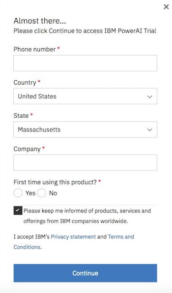
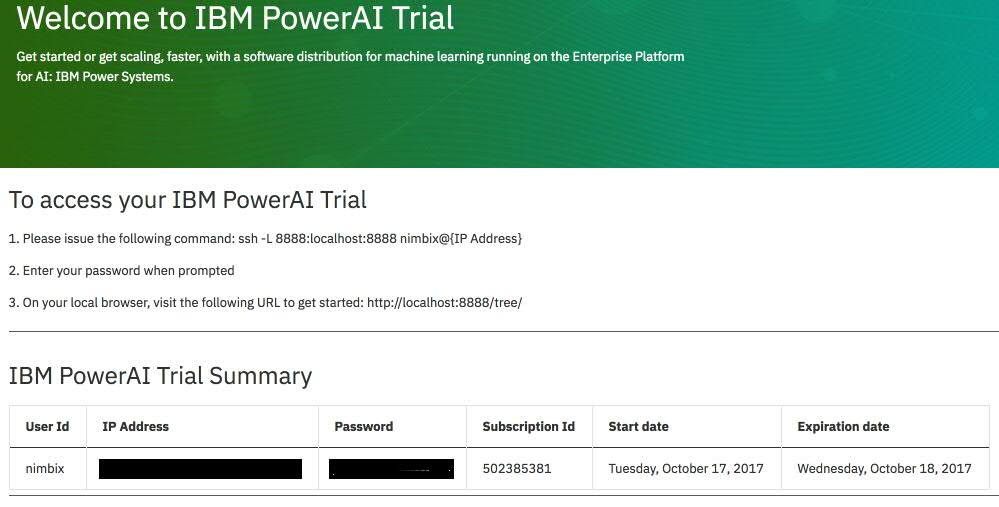

# seeFOOD CNN, a binary classifier written in Keras and converted to CoreML


Walk you through how to use GPU hardware in the Cloud with Nimbix, to quickly train and deploy a Convolutional Neural Network Model that can tell you whether your lunchtime nutritional choice is the right one - all with the camera of the mobile phone in your pocket. All you need are some photos, descriptions of them, and you can be up and running with a model to stream video through in no time flat.

I'm sure you've seen the episode of Silicon Valley, but to give you an idea of the amazing technology we are going to share with you today here's a clip:

<p align="center">
	<a href="https://www.youtube.com/watch?v=ACmydtFDTGs" target="_blank">
		
	</a>
</p>

So you want to identify hotdogs - great! Summer is just around the corner, and you can never be too careful with what you're eating. You too can develop an app that identifies **Hot Dog** and the alternatives... **Not Hot Dog**


## Overview
This repo will walk you through the steps, and technologies to train a Deep Learning model using a Convolutional Netural Network, evaluate its accuracy, and save it into a format that can be loaded on an iOS device. With a model converted to Apple's CoreML format we will load a `.mlmodel` into an opensource project: [Lumina](https://github.com/dokun1/lumina).  Within Lumina you can quickly import and activate your .mlmodel, and stream object predictions in real time from the camera feed...Let me repeat, you can stream object predictions from the camera feed in real time - and you can do this with one line of code.

<p align="center">
	
</p>

## Demo
<p align="center">
	
</p>

## Technologies

#### Lumina 
*[Lumina](https://github.com/dokun1/lumina) is an iOS camera designed in Swift that can use any CoreML model for object recognition, as well as streaming video, images, and qr/bar codes.*


#### CoreMLTools
*[CoreMLTools](https://github.com/apple/coremltools) integrates trained machine learning models into your iOS app*


#### Keras 
*[Keras.io](https://keras.io/) is a high-level neural networks API, written in Python and capable of running on top of TensorFlow, CNTK, or Theano.*


#### Nimbix
*[Nimbix](https://nimbix.net) provides super computing in the Cloud*


#### PowerAI
*[PowerAI](https://www.ibm.com/us-en/marketplace/deep-learning-platform/details#product-header-top)  takes advantage of the CPU:GPU NVLink interconnect (that's a fat pipe between CPU:GPU:Memory) to help support and load larger deep learning models than ever before. Train datasets that could never be trained before utilizing system memory without bottlenecks*


## Steps

Follow these steps to setup and run this *phenomenon sweepng the vegan meat industry*. The steps are
described in detail below.

1. [Get 24-hours of free access to the PowerAI platform](#1-get-7-Days-of-free-access-to-the-powerai-platform)
1. [Access and start the Jupyter notebook](#2-access-and-start-the-jupyter-notebook)
1. [Run the notebook](#3-run-the-notebook)
1. [Save and share your model ](#4-save-and-share-your-model)
1. [End your trial](#5-end-your-trial)

## 1. Get 24-Hours of free access to the PowerAI platform

IBM has partnered with Nimbix to provide cognitive developers a trial
account that provides 24-Hours of free processing time on the PowerAI
platform. Follow these steps to register for access to Nimbix to try
the PowerAI Cognitive Code Patterns and explore the platform.

Go to the [IBM Marketplace PowerAI Portal](https://www.ibm.com/us-en/marketplace/deep-learning-platform), and click `Request Trial`.

On the IBM PowerAI Trial page, shown below, enter the required information to sign up for an IBM account and click `Continue`. If you already have an IBM ID, click `Already have an account? Log in`, enter your credentials and click `Continue`.


On the **Almost there…** page, shown below, enter the required information and click `Continue` to complete the registration and launch the **IBM Marketplace Products and Services** page.



Your **IBM Marketplace Products and Services** page displays all offerings that are available to you; the PowerAI Trial should now be one of them. From the PowerAI Trial section, click `Launch`, as shown below, to launch the **IBM PowerAI trial** page.


The **Welcome to IBM PowerAI Trial** page provides instructions for accessing the trial, as shown below. Alternatively, you will receive an email confirming your registration with similar instructions that you can follow to start the trial.



Summary of steps for starting the trial:

* Start a terminal session from your local machine and issue the following command where `{IP Address}` is the IP Address (or host name) shown on the welcome page (or in the confirmation email).
  ```sh
  ssh -L 8888:localhost:8888 nimbix@{IP Address}
  ```

* Enter the password shown on the welcome page (or in the confirmation email) when prompted.

* From your local browser, go to the following URL to get started: http://localhost:8888/tree/.

## 2. Access and start the Jupyter notebook

Use git clone to download the example notebook, dataset, and retraining library with a single command.

* Get a new terminal window by clicking on the ```New``` pull-down and selecting ``Terminal``.


* Run the following command to clone the git repo:

```commandline
git clone https://github.com/justinmccoy/keras-binary-classifier
```

* Once done, you can exit the terminal and return to the notebook browser. Use the ``Files`` tab and click on ``keras-binary-classifier`` then ``notebooks`` and then ``Hotdog_NotHotdog_CNN.ipynb`` to open the notebook.


## 3. Run the notebook

When a notebook is executed, what is actually happening is that each code cell in
the notebook is executed, in order, from top to bottom.

Each code cell is selectable and is preceded by a tag in the left margin. The tag
format is `In [x]:`. Depending on the state of the notebook, the `x` can be:

* A blank, this indicates that the cell has never been executed.
* A number, this number represents the relative order this code step was executed.
* A `*`, this indicates that the cell is currently executing.

There are several ways to execute the code cells in your notebook:

* One cell at a time.
  * Select the cell, and then press the `Play` button in the toolbar.
* Batch mode, in sequential order.
  * From the `Cell` menu bar, there are several options available. For example, you
    can `Run All` cells in your notebook, or you can `Run All Below`, that will
    start executing from the first cell under the currently selected cell, and then
    continue executing all cells that follow.


## 4. Save and share your model

### How to save your work:

Because this notebook is running temporarily on a Nimbix
Cloud server, use the following options to save your work:

Under the `File` menu, there are options to:

* `Download as...` will download the notebook to your local system.
* `Print Preview` will allow you to print the current state of the
  notebook.
* Select `Download  as...` and then `seefood.mlmodel` to download your trained food classifier

## 5. End your trial

When you are done with your work, please cancel your subscription by issuing the following command in your ssh session or by visiting the `Manage` link on the **My Products and Services** page.

```sh
sudo poweroff --force
```

## Links
* [Free Trial to GPU Accelerated HW in the Cloud](https://developer.ibm.com/linuxonpower/cloud-resources/)
* [Learn how to use Lumina in an iOS app](https://www.youtube.com/watch?v=8eEAvcy708s)

## License
[Apache 2.0](LICENSE)
